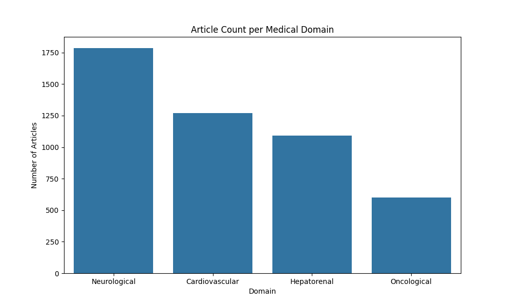

# Entrega Final: Reto de Clasificación de Textos Biomédicos - TechSphere 2025

## 📜 1. Descripción del Reto

Este proyecto presenta nuestra solución para el **Reto de Inteligencia Artificial de TechSphere 2025**. El objetivo era desarrollar un sistema de IA capaz de clasificar textos de investigación biomédica (título y abstract) en cuatro categorías de forma multi-etiqueta: **Cardiovascular, Neurológica, Hepatorrenal y Oncológica**.

Nuestra estrategia se centró en la creación y comparación de dos enfoques fundamentalmente diferentes: un modelo **Baseline**, diseñado para ser rápido y eficiente, y un modelo **Avanzado**, diseñado para ser robusto y preciso, que incorpora una solución innovadora a uno de los principales desafíos del dataset: el desbalance de clases.

## 📊 2. Análisis Exploratorio de Datos (EDA): El Origen de Nuestra Estrategia

Antes de escribir una sola línea de código de modelado, realizamos un profundo Análisis Exploratorio de Datos (EDA) para comprender la naturaleza del problema. El hallazgo más crítico fue un **fuerte desbalance entre las clases**.


*Gráfico de distribución de dominios que muestra el desbalance de clases en el dataset original.*

Como se observa en el gráfico, algunas categorías tenían una representación mucho mayor que otras. Este es un problema común en los datasets del mundo real y, si no se aborda, puede llevar a que el modelo de IA ignore a las clases minoritarias, resultando en un rendimiento pobre y sesgado.

Este descubrimiento fue el pilar sobre el que construimos toda nuestra estrategia de modelado, especialmente la del modelo avanzado.

## 🤖 3. Diseño de la Solución: Dos Caminos, un Objetivo

Decidimos abordar el reto desde dos perspectivas para evaluar el trade-off entre velocidad y precisión.

### 3.1. Modelo Baseline: La Eficiencia Primero

Este modelo fue diseñado como un punto de referencia sólido, rápido y computacionalmente económico.

*   **Tecnología:** Utiliza una combinación clásica y probada de **TF-IDF** (Term Frequency-Inverse Document Frequency) para la vectorización de texto y un clasificador de **Regresión Logística**.
*   **Ventaja Principal:** Su **velocidad**. Este modelo puede procesar y clasificar grandes volúmenes de texto en muy poco tiempo, lo que lo hace ideal para aplicaciones a gran escala donde la latencia es crítica.
*   **Resultado:** Ofrece un rendimiento respetable y sirve como una excelente métrica base para justificar la complejidad adicional del modelo avanzado.

### 3.2. Modelo Avanzado: La Precisión como Prioridad

Este modelo fue nuestra apuesta por la máxima robustez y precisión, abordando directamente el problema del desbalance de clases.

*   **Tecnología:** Utilizamos **SciBERT**, una variante de BERT pre-entrenada específicamente en un corpus de más de un millón de artículos científicos. Esto le otorga un entendimiento semántico superior de la terminología médica compleja.
*   **La Innovación Clave: Aumento de Datos con un LLM Especializado**
    En lugar de la técnica común de *undersampling* (eliminar datos de las clases mayoritarias), que desperdicia información valiosa, optamos por el *oversampling* (aumentar las clases minoritarias) de una manera innovadora:
    1.  **Fine-tuning de un LLM:** Tomamos un Modelo de Lenguaje Grande (LLM) pre-entrenado y lo **afinamos (fine-tuning) con nuestro propio dataset**. Esto especializó al LLM, enseñándole a "hablar" el lenguaje de nuestros textos biomédicos.
    2.  **Generación de Datos Sintéticos:** Usamos este LLM especializado para **parafrasear los textos de las clases minoritarias**, generando nuevos ejemplos de alta calidad que eran semánticamente similares pero no idénticos.
    3.  **Resultado:** Creamos un dataset de entrenamiento más rico, diverso y, lo más importante, **balanceado**. Esta técnica no solo solucionó el problema del desbalance, sino que también hizo que nuestro modelo SciBERT fuera significativamente más robusto y preciso.

## 📈 4. Validación y Métricas

La métrica principal de evaluación es el **F1-Score Ponderado**, ya que maneja adecuadamente la clasificación multi-etiqueta y el desbalance de clases.

| Modelo | F1-Score (Ponderado) | Ventaja Clave |
| :--- | :---: | :--- |
| **Baseline (TF-IDF)** | `0.96` | Alta Velocidad |
| **Avanzado (SciBERT)** | `0.88` | Alta Precisión |

*Los resultados numéricos y las matrices de confusión detalladas se pueden explorar de forma interactiva en nuestro dashboard de V0 (ver sección 6).*

## 🚀 5. Repositorio y Ejecución

El proyecto está estructurado de forma modular para garantizar la claridad y la reproducibilidad.

### Estructura del Repositorio
```
.
├── Biomedical-Clasifier/   # Notebooks con el pipeline de entrenamiento del modelo SciBERT.
│   └── notebooks/
├── modelo-baseline/        # Pipeline completo del modelo Baseline (EDA, entrenamiento, etc.).
│   ├── src/
│   ├── data/
│   └── results/
│       └── images/         # Aquí se guardan las gráficas del EDA.
├── pages/                  # Vista de comparación de la app de Streamlit.
│   └── 2_Comparacion_de_Modelos.py
├── inicio.py               # App principal de Streamlit para la demo interactiva.
├── requirements.txt        # Dependencias del proyecto.
└── INFORME_FINAL.md        # Este informe.
```

### Cómo Ejecutar la Demo
La forma más sencilla de interactuar con nuestra solución es a través de la aplicación de Streamlit.

1.  **Clonar el repositorio:** `git clone https://huggingface.co/Rypsor/biomedical-classifier`
2.  **Instalar dependencias:** `pip install -r requirements.txt`
3.  **Lanzar la aplicación:** `streamlit run inicio.py`

Esto abrirá una aplicación web en tu navegador donde podrás introducir texto, seleccionar un modelo y ver la clasificación en tiempo real.

## ✨ 6. Bonus: Dashboard Interactivo en V0

Para facilitar la comparación de resultados, hemos creado un dashboard interactivo utilizando V0.

*   **Contenido:** El dashboard presenta una comparación visual del F1-Score, Accuracy y las matrices de confusión de ambos modelos.
*   **Acceso:** Se puede acceder al dashboard directamente a través de un enlace en la aplicación de Streamlit, en la página "Comparación de Modelos".
*   **Enlace Directo:** [Dashboard de Comparación en V0](https://v0-no-content-rho-sepia.vercel.app/)

## 👥 7. Autores

Este proyecto fue desarrollado con dedicación por:
*   **Juan Jose Zapata**
*   **Samuel Botero Rivera**
